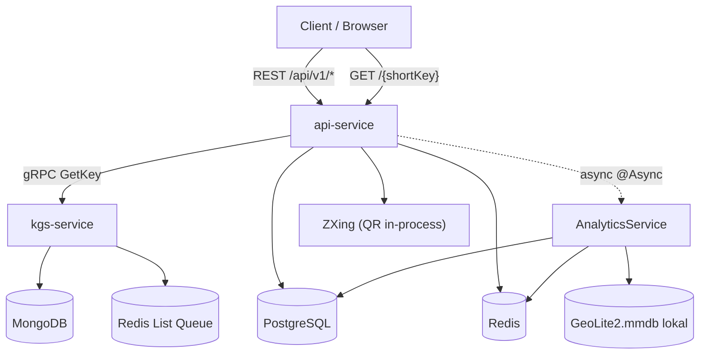
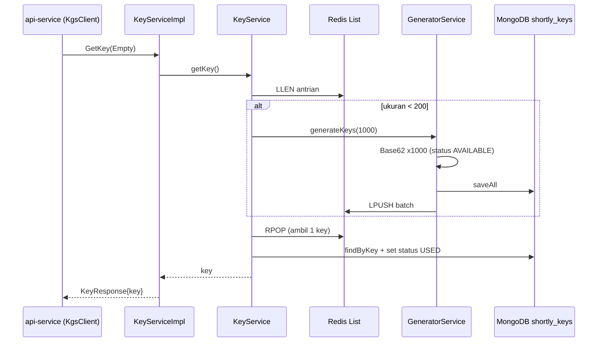
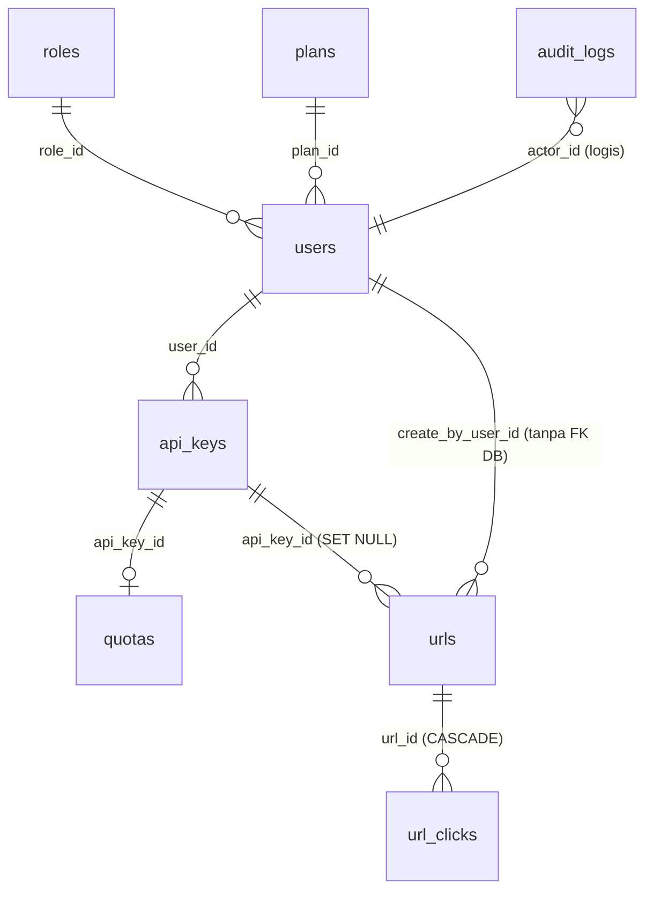
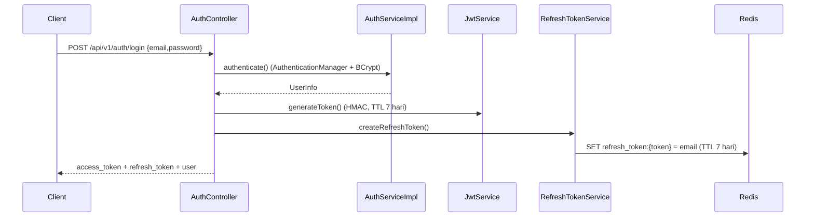
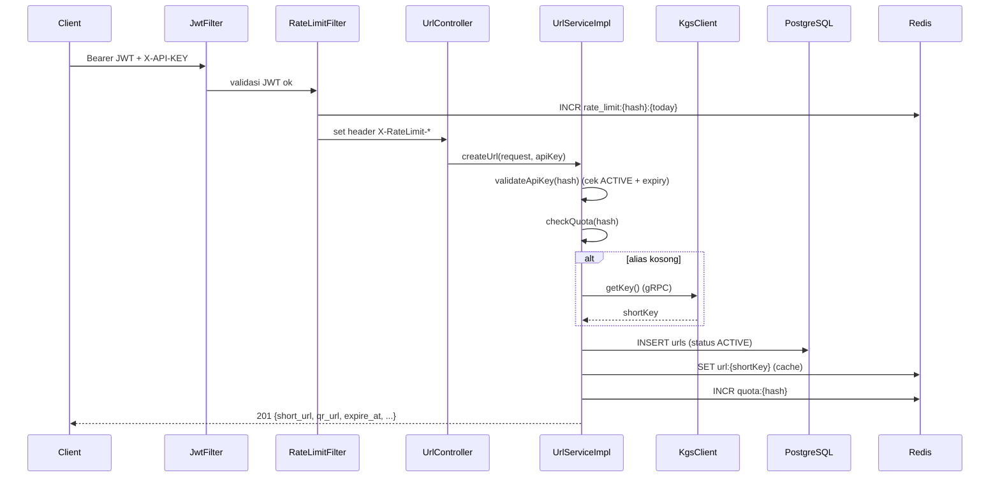
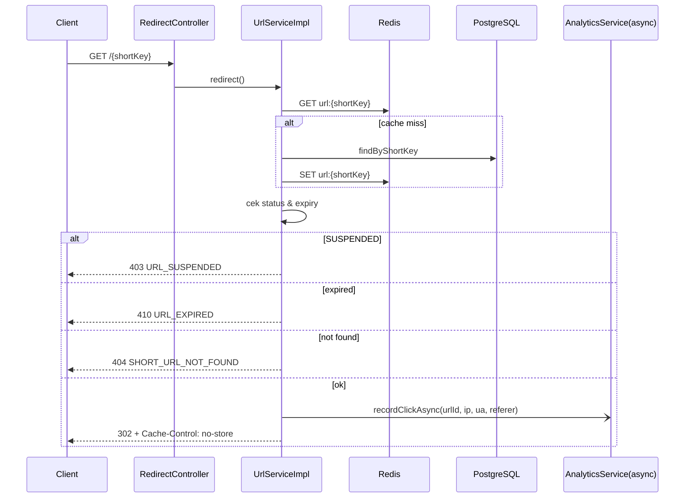

# Dokumentasi Sistem Shortly

> URL Shortener SaaS berbasis Spring Boot multi-module dengan tier plan (FREE/PRO), autentikasi berlapis (JWT + API Key), rate limiting, kuota, analytics klik, QR code, dan panel admin.

Dokumen ini menjelaskan arsitektur, model data, autentikasi, dan seluruh alur bisnis end-to-end.

---

## Daftar Isi

1. [Ringkasan Produk](#1-ringkasan-produk)
2. [Arsitektur Tingkat Tinggi](#2-arsitektur-tingkat-tinggi)
3. [Modul `proto`](#3-modul-proto-kontrak-grpc)
4. [Modul `kgs-service`](#4-modul-kgs-service-key-generation-service)
5. [Skema Database `api-service`](#5-skema-database-api-service-postgresql--flyway)
6. [Autentikasi & Otorisasi](#6-autentikasi--otorisasi)
7. [Alur Bisnis Inti](#7-alur-bisnis-inti)
8. [Rate Limiting & Kuota](#8-rate-limiting--kuota)
9. [Peta Penggunaan Redis](#9-peta-penggunaan-redis)
10. [Ketahanan & Error Handling](#10-ketahanan-resilience4j--error-handling)
11. [Peta Endpoint Final](#11-peta-endpoint-final)
12. [Catatan Teknis](#12-catatan-teknis)

---

## 1. Ringkasan Produk

Shortly adalah layanan pemendek URL dengan model SaaS. Sistem dipecah menjadi 3 modul Maven.

| Modul | Peran | Teknologi Inti |
|---|---|---|
| `api-service` | REST API utama + redirect publik | Spring Boot, PostgreSQL, Redis, Spring Security, JWT |
| `kgs-service` | Key Generation Service (penghasil short key unik) | Spring Boot, MongoDB, Redis, gRPC server |
| `proto` | Kontrak gRPC bersama | Protobuf, gRPC |

**Tier plan:**

| Plan | max_requests_per_day | max_urls_per_key | max_bulk |
|---|---|---|---|
| FREE | 100 | 10 | 0 |
| PRO | 1000 | 1000 | 100 |

Fitur khusus PRO: custom alias, custom expiry, bulk shorten, dan advanced analytics.

---

## 2. Arsitektur Tingkat Tinggi



**Prinsip kunci:**

- **Redirect harus cepat** - pencatatan analytics (geo lookup, parse user-agent, insert DB, update HyperLogLog) dilempar ke thread pool terpisah (`@Async`), tidak memblokir response redirect.
- **Dua kredensial berbeda** - JWT membuktikan *siapa user-nya*; `X-API-KEY` menentukan *plan/limit/kuota* dan dipakai untuk operasi pembuatan URL.
- **KGS terpisah** - pembuatan short key di-outsource ke microservice khusus dengan pool key yang sudah di-pre-generate.

---

## 3. Modul `proto` (Kontrak gRPC)

Satu file kontrak: `proto/src/main/proto/key.proto`

```protobuf
syntax = "proto3";
package key;
option java_package = "com.shortly.proto.key";
option java_multiple_files = true;

service KeyService {
  rpc GetKey(Empty) returns (KeyResponse);
}
message Empty {}
message KeyResponse {
  string key = 1;
}
```

- Satu RPC unary: `key.KeyService/GetKey`, input kosong, output satu string `key`.
- Di-compile jadi `KeyServiceGrpc` + message classes, dipakai `kgs-service` (server) dan `api-service` (client via `KgsClient`).

---

## 4. Modul `kgs-service` (Key Generation Service)

### 4.1 Tujuan

Menghasilkan short key **Base62 acak sepanjang 6 karakter** secara batch, menyimpannya di MongoDB (state `AVAILABLE`/`USED`), dan melayaninya cepat lewat antrian Redis.

### 4.2 Algoritma Key

`utils/Base62.java` - charset 62 karakter (`0-9a-zA-Z`), memakai `SecureRandom` + `BigInteger`, panjang 6 (hardcoded). Random (bukan counter/sequential). Keunikan dijaga oleh index unik MongoDB pada field `key`.

### 4.3 Alur `GetKey`



**Detail penting (`constant/Constant.java`):**

- `REDIS_QUEUE_NAME = "shortly-kgs-redis-queue"` (Redis List).
- `QUEUE_LENGTH = 200` - ambang bawah; jika antrian < 200, regenerasi.
- `KEY_COUNT = 1000` - jumlah key per batch.
- **Tidak ada scheduler/cron** - replenish hanya on-demand saat `getKey()` dipanggil dan antrian menipis.
- FIFO: produksi `LPUSH` (kepala), konsumsi `RPOP` (ekor).
- Setelah 3 retry gagal, lempar `RuntimeException` (dipropagasi sebagai gRPC error).

### 4.4 Penyimpanan & Konfigurasi

- **MongoDB** collection `shortly_keys`: dokumen `ShortlyKey{ id, key (unique index), status, createdAt }`, enum status `AVAILABLE`/`USED`.
- **Redis List**: antrian key siap pakai.
- Config (`application.properties`): Mongo `mongodb://localhost:27017/shortly`, Redis `127.0.0.1:6379`, `server.port=9090` (gRPC juga di 9090 lewat `net.devh:grpc-server-spring-boot-starter`).

---

## 5. Skema Database `api-service` (PostgreSQL + Flyway)

Migrasi V1-V14. ER diagram skema akhir:



**Tabel utama:**

- `users` - id (UUID), email, password (bcrypt), status, `role_id`, `plan_id`, soft-delete via `deleted_at`.
- `roles` - `USER`, `ADMIN`.
- `plans` - limit per tier (lihat tabel di bagian 1).
- `api_keys` - `key_hash` (SHA-256 hex, TEXT), status, `expires_at` (default +7 hari saat dibuat).
- `quotas` - snapshot limit **per API key** (source-of-truth limit runtime; bisa di-override admin). Kolom `updated_at` dipetakan di entity (`@UpdateTimestamp`).
- `urls` - `short_key` (unik), `original_url`, `expires_at`, `status` (ACTIVE/SUSPENDED), `suspended_reason`; soft-delete Hibernate (`@SQLDelete` + `@SQLRestriction("deleted_at IS NULL")`).
- `url_clicks` - raw click events (ip, country, device, os, browser, referrer_host), index `(url_id, clicked_at)`, FK `ON DELETE CASCADE`.
- `audit_logs` - jejak aksi user/admin (actor, action, target, ip).

**Migrasi terkait redesign:**

- `V12__add_status_to_url.sql` - tambah `status` + `suspended_reason` ke `urls`.
- `V13__create_url_clicks_table.sql` - tabel `url_clicks` + index.
- `V14__backfill_seed_data.sql` - isi `plan_id` seed user (free->FREE, pro->PRO, admin->PRO) & koreksi `audit_logs.target_type` dari `URL` menjadi `SHORT_URL`.

**Enum `ExceptionType`** memetakan kode bisnis -> pesan + HTTP status. Contoh: `ALIAS_ALREADY_TAKEN`(409), `URL_EXPIRED`(410), `RATE_LIMIT_EXCEEDED`(429), `QUOTA_EXCEEDED`(429), `BULK_LIMIT_EXCEEDED`(429), `NOT_PRO_PLAN`(403), `ACCOUNT_SUSPENDED`(403), `URL_SUSPENDED`(403), `INVALID_API_KEY`(400).

---

## 6. Autentikasi & Otorisasi

### 6.1 Model dua kredensial

| Kebutuhan | Mekanisme | Lokasi |
|---|---|---|
| Siapa user-nya | JWT Bearer -> `SecurityContext` | `JwtAuthenticationFilter` |
| Plan/limit/kuota mana | `X-API-KEY` -> hash SHA-256 | `RateLimitFilter`, `UrlServiceImpl`, `PlanServiceImpl` |

Raw API key **tidak pernah disimpan** - hanya hash SHA-256 hex di `api_keys.key_hash`.

### 6.2 Urutan filter (`ApiSecurityConfig`)

`JwtAuthenticationFilter` -> `RateLimitFilter` -> `UsernamePasswordAuthenticationFilter` -> filter Spring lainnya. Sesi `STATELESS`.

Path publik: `/api/v1/auth/**`, Swagger (`/v3/api-docs/**`, `/swagger-ui/**`), `/webhook/xendit/**`, dan `GET /{shortKey}`.

### 6.3 Alur Login / Refresh / Logout



- **Refresh** - cari `refresh_token:{oldToken}` di Redis, evict, terbitkan access+refresh baru (rotasi).
- **Logout** - blacklist access token ke Redis `token_blacklist:{accessToken}` dengan TTL = sisa masa berlaku token (dari klaim `exp`), lalu hapus refresh token. `JwtAuthenticationFilter` mengecek blacklist ini di setiap request sehingga access token yang sudah logout langsung ditolak.
- **/me** - ambil user aktif dari `SecurityContext`.

### 6.4 Otorisasi admin

`@PreAuthorize("hasRole('ADMIN')")` di controller admin (`AdminUrlController`, `AdminApiKeyController`). Fitur PRO dibatasi lewat cek `user.getPlan().getName() == PlanType.PRO`, bukan role.

---

## 7. Alur Bisnis Inti

### 7.1 Registrasi

`UserServiceImpl.register`: cek email unik -> encode password (BCrypt) -> assign role `USER` + plan `FREE` -> simpan user -> generate API key (`ApiKeyService.createApiKey`, yang juga membuat baris `quotas` snapshot dari plan) -> kembalikan user + **raw API key sekali tampil**.

### 7.2 Buat Short URL (single)



**Aturan bisnis:**

- `alias` (custom short key) - **hanya PRO**; jika FREE -> `403 NOT_PRO_PLAN`; jika bentrok -> `409 ALIAS_ALREADY_TAKEN`.
- `expire_at` custom - **hanya PRO**; default FREE = sekarang + 7 hari.
- URL tidak valid (bukan http/https absolut) -> `400 INVALID_URL`.
- Alias kosong -> ambil key dari KGS (dengan retry unik terhadap PostgreSQL).
- `validateApiKey` menolak key yang tidak `ACTIVE` atau sudah kedaluwarsa -> `INVALID_API_KEY`.

### 7.3 Buat Short URL (bulk) - PRO only

`POST /api/v1/urls/bulk`. Validasi jumlah item terhadap `maxBulk` (dari quota); jika lewat -> `429 BULK_LIMIT_EXCEEDED`. Diproses **per item** (partial success): satu item gagal tidak menggagalkan batch. Response `{ total, succeeded, failed, results[] }`.

### 7.4 Redirect `GET /{shortKey}`



### 7.5 Analytics

**Pencatatan (async, `@Async` executor `analyticsExecutor`):**

- Parse User-Agent (YAUAA) -> device/os/browser.
- GeoIP (MaxMind GeoLite2 lokal, opsional; jika file `.mmdb` tidak ada -> country null, tidak error).
- `INSERT url_clicks`.
- Redis HyperLogLog: `PFADD analytics:hll:{urlId}:{tanggal}` dan global `analytics:hll:global:{tanggal}` untuk unique visitor.
- `INCR analytics:clicks:total:{urlId}` untuk total cepat.
- Exception di thread async **hanya di-log**, tidak mengganggu redirect.

**Query:**

- `GET /api/v1/urls/{id}/analytics` (User & PRO): `total_clicks` (COUNT rentang), `unique_visitors` (PFCOUNT gabungan HLL per hari dalam rentang `from`/`to`).
- `GET /api/v1/urls/{id}/analytics/advanced` (**PRO only**): tambahan agregasi `GROUP BY` - by_day, by_country, by_device, by_os, by_browser, by_referrer.

### 7.6 QR Code

`GET /api/v1/urls/{id}/qr?size=300&format=png|svg`. Meng-encode **short URL** (bukan original) via ZXing. Hasil byte di-cache Redis `qr:{id}:{size}:{format}` TTL 24 jam. Header: `Content-Type` sesuai format, `Content-Disposition: inline`, `Cache-Control: public, max-age=86400`.

### 7.7 Manajemen API Key (self-service) - `/api/v1/keys`

- `GET` - daftar key milik user (status, expiry, quota); **tidak pernah** mengembalikan `key_hash`.
- `POST` - buat key baru, tampilkan raw key sekali + pesan warning.
- `DELETE /{id}` - revoke dengan **cek kepemilikan** (bukan milik user -> `403`), lalu evict cache `plan:{hash}`.

Admin punya `/api/v1/admin/api-keys/{id}/rotate` & `DELETE` untuk key user manapun (diproteksi `hasRole('ADMIN')`).

### 7.8 Admin - `/api/v1/admin`

- `GET /metrics` - agregasi user/url/click/api_key.
- `GET /users` - list user (pagination + filter status/search + total_urls).
- `PATCH /users/{id}/status` - SUSPEND/ACTIVATE user (login user SUSPENDED ditolak `403 ACCOUNT_SUSPENDED`).
- `PATCH /users/{id}/quota` - override quota per user -> update baris `quotas` -> evict `plan:{hash}` agar limit baru langsung berlaku.
- `PATCH /urls/{id}/status` - SUSPEND/ACTIVATE URL -> invalidasi cache `url:{shortKey}`.

---

## 8. Rate Limiting & Kuota

| Aspek | Rate Limit | Kuota |
|---|---|---|
| Batasi apa | Request per hari per API key | Jumlah URL per API key |
| Redis key | `rate_limit:{hash}:{yyyy-MM-dd}` | `quota:{hash}` |
| Reset | Tengah malam (TTL sampai midnight) | Fallback DB `COUNT` saat cache miss |
| Limit dari | `plan.maxRequestsPerDay` (via `quotas`) | `plan.maxUrlsPerKey` (via `quotas`) |
| Error | `429 RATE_LIMIT_EXCEEDED` | `429 QUOTA_EXCEEDED` |
| Header | `X-RateLimit-Limit/Remaining/Reset` | - |

Rate limit hanya aktif untuk `POST /api/v1/urls` dan `/api/v1/urls/bulk`. Limit runtime bersumber dari tabel `quotas` (di-cache `plan:{hash}` 1 jam), sehingga admin bisa override per user.

Counter kuota di-`INCR` saat URL dibuat dan di-`DECR` saat URL dihapus (`delete` & `deleteForAdmin`), dengan guard bila `apiKey` null.

---

## 9. Peta Penggunaan Redis

| Key | Isi | TTL | Dipakai |
|---|---|---|---|
| `refresh_token:{token}` | email | 7 hari | Refresh/logout |
| `token_blacklist:{token}` | "true" | sisa masa berlaku token | Logout (dicek JWT filter) |
| `rate_limit:{hash}:{date}` | counter | s/d midnight | Rate limit |
| `plan:{hash}` | ApiKeyPlanCache | 1 jam | Plan/limit |
| `auth:user:{email}` | UserInfo | 24 jam | UserDetails |
| `quota:{hash}` | counter | 1 jam | Kuota URL |
| `url:{shortKey}` | UrlCache | mengikuti expiry URL | Redirect |
| `qr:{id}:{size}:{format}` | byte[] QR | 24 jam | QR code |
| `analytics:clicks:total:{urlId}` | counter | - | Total klik |
| `analytics:hll:{urlId}:{date}` | HyperLogLog | - | Unique visitor per URL |
| `analytics:hll:global:{date}` | HyperLogLog | - | Unique visitor global |

---

## 10. Ketahanan (Resilience4j) & Error Handling

- `KgsClient.getKey()` dibungkus `@Retry(name="kgsRetry")` + `@CircuitBreaker(name="kgsCircuitBreaker")`, deadline gRPC 2 detik, fallback = UUID substring(0,6). Tidak ada properti custom -> memakai default Resilience4j Spring Boot 3.
- `GenericExceptionHandler` (`@ControllerAdvice`) mengubah `ApplicationException` menjadi response error dengan `error.code` string bisnis + HTTP status yang tepat, plus handler khusus untuk auth exception dan validasi (`VALIDATION_ERROR`).

Format error response:

```json
{
  "success": false,
  "error": {
    "code": "ALIAS_ALREADY_TAKEN",
    "message": "Alias sudah digunakan"
  },
  "timestamp": "2026-07-06T01:00:00"
}
```

---

## 11. Peta Endpoint Final

| Area | Method & Path | Akses |
|---|---|---|
| Auth | POST `/api/v1/auth/register` | Guest |
| Auth | POST `/api/v1/auth/login` | Guest |
| Auth | POST `/api/v1/auth/refresh` | Guest (butuh refresh token) |
| Auth | POST `/api/v1/auth/logout` | Authenticated |
| Auth | GET `/api/v1/auth/me` | Authenticated |
| URL | POST `/api/v1/urls` | User/Pro (+X-API-KEY) |
| URL | GET `/api/v1/urls` | User/Pro |
| URL | GET `/api/v1/urls/{id}` | User/Pro |
| URL | PATCH `/api/v1/urls/{id}` (expiry) | User/Pro |
| URL | DELETE `/api/v1/urls/{id}` | User/Pro |
| URL | POST `/api/v1/urls/bulk` | Pro only |
| QR | GET `/api/v1/urls/{id}/qr` | User/Pro |
| Analytics | GET `/api/v1/urls/{id}/analytics` | User/Pro |
| Analytics | GET `/api/v1/urls/{id}/analytics/advanced` | Pro only |
| API Keys | GET/POST `/api/v1/keys`, DELETE `/api/v1/keys/{id}` | User/Pro |
| Admin | GET `/api/v1/admin/metrics` | Admin |
| Admin | GET `/api/v1/admin/users` | Admin |
| Admin | PATCH `/api/v1/admin/users/{id}/status` | Admin |
| Admin | PATCH `/api/v1/admin/users/{id}/quota` | Admin |
| Admin | PATCH `/api/v1/admin/urls/{id}/status` | Admin |
| Admin | GET `/api/v1/admin/urls`, GET/PUT/DELETE `/api/v1/admin/urls/{id}` | Admin |
| Admin | POST `/api/v1/admin/api-keys/{id}/rotate`, DELETE `/{id}` | Admin |
| Public | GET `/{shortKey}` | Public (redirect) |

Semua endpoint di atas otomatis muncul di Swagger UI (`/swagger-ui/`).
