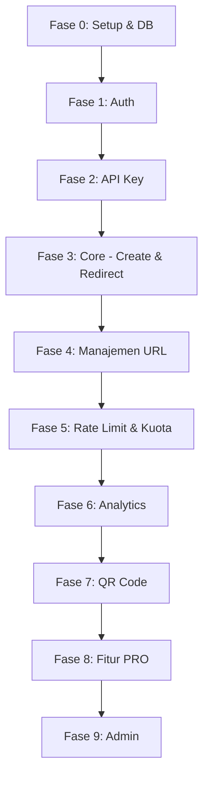
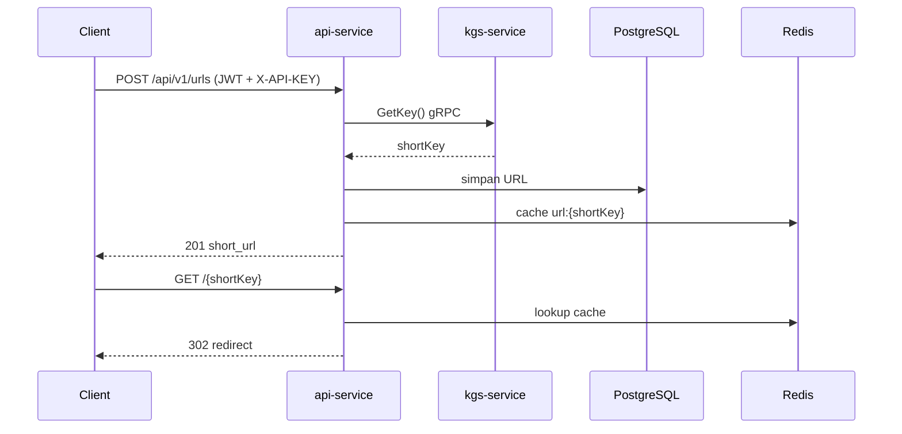
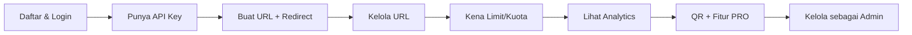

# Roadmap Praktik: Urutan Pembuatan Endpoint - Shortly

> Panduan langkah demi langkah menentukan endpoint mana yang dibuat lebih dulu, dari fondasi sampai fitur lanjutan, agar kamu benar-benar memahami proses bisnis sambil praktik langsung.

Dokumen ini melengkapi [ARCHITECTURE.md](ARCHITECTURE.md) (arsitektur & alur) dan [TECH-STACK.md](TECH-STACK.md) (teknologi). Ikuti fase secara berurutan; setiap fase dibangun di atas fase sebelumnya.

---

## Prinsip Urutan

Bangun dari yang paling fondasional ke yang paling turunan:

1. **Fondasi dulu** - tanpa user & auth, tidak ada yang bisa dites secara aman.
2. **Kredensial akses** - API key diperlukan sebelum bisa membuat URL.
3. **Fitur inti (core)** - membuat & redirect URL adalah jantung produk.
4. **Proteksi** - rate limit & kuota melindungi core.
5. **Nilai tambah** - analytics, QR.
6. **Fitur premium & admin** - dibangun terakhir karena bergantung ke semuanya.

---

## Fase 0 - Setup & Database (fondasi, belum ada endpoint)

**Tujuan:** menyiapkan skema data & keamanan dasar sebelum menulis endpoint.

- Siapkan PostgreSQL + migrasi Flyway: `roles`, `plans`, `users` (V1-V...).
- Siapkan Redis & konfigurasi koneksi.
- Konfigurasi Spring Security dasar (`ApiSecurityConfig`) dengan sesi `STATELESS`.

**Yang dipelajari:** model domain inti (user punya role & plan) dan pondasi keamanan.

---

## Fase 1 - Autentikasi

**Kenapa pertama:** semua endaya lain butuh identitas user. Tanpa ini kamu tidak bisa menguji endpoint terproteksi.

| Urutan | Endpoint                     | Fungsi                                                                            |
| ------ | ---------------------------- | --------------------------------------------------------------------------------- |
| 1      | `POST /api/v1/auth/register` | Daftar user (buat user + assign role USER + plan FREE + generate API key pertama) |
| 2      | `POST /api/v1/auth/login`    | Login -> access token (JWT) + refresh token                                       |
| 3      | `GET /api/v1/auth/me`        | Cek identitas dari token (validasi filter JWT)                                    |
| 4      | `POST /api/v1/auth/refresh`  | Perpanjang sesi (rotasi refresh token)                                            |
| 5      | `POST /api/v1/auth/logout`   | Cabut sesi (blacklist access token + hapus refresh token)                         |

**Proses bisnis yang dipahami:** siklus hidup sesi (login -> pakai -> refresh -> logout), stateless auth, dan bahwa registrasi otomatis membuat API key pertama.

**Tips praktik:** buat register dulu, langsung login, simpan token, lalu tes `/me`. Setelah itu baru refresh & logout.

---

## Fase 2 - Manajemen API Key (self-service)

**Kenapa di sini:** membuat URL butuh header `X-API-KEY`. Kamu perlu bisa melihat/membuat key sebelum fase core.

| Urutan | Endpoint                   | Fungsi                                             |
| ------ | -------------------------- | -------------------------------------------------- |
| 1      | `GET /api/v1/keys`         | Lihat daftar API key milik user (+ status & kuota) |
| 2      | `POST /api/v1/keys`        | Buat API key baru (raw key tampil sekali)          |
| 3      | `DELETE /api/v1/keys/{id}` | Revoke key milik sendiri (cek kepemilikan)         |

**Proses bisnis yang dipahami:** dua kredensial berbeda (JWT = siapa user, API key = plan/limit/kuota), raw key hanya ditampilkan sekali, key ter-hash (SHA-256) di DB.

**Tips praktik:** buat key baru, catat raw key-nya untuk fase berikutnya.

---

## Fase 3 - Core: Buat URL & Redirect (jantung produk)

**Kenapa krusial:** ini nilai inti produk. Bangun paling sederhana dulu (tanpa alias/expiry custom).

| Urutan | Endpoint            | Fungsi                                             |
| ------ | ------------------- | -------------------------------------------------- |
| 1      | `POST /api/v1/urls` | Buat short URL (ambil short key dari KGS via gRPC) |
| 2      | `GET /{shortKey}`   | Redirect publik ke original URL                    |

**Proses bisnis yang dipahami:**

- Alur create: validasi API key (ACTIVE + belum expired) -> cek kuota -> minta key ke `kgs-service` (gRPC) -> simpan ke DB -> cache ke Redis (`url:{shortKey}`).
- Alur redirect: cek cache Redis dulu, kalau miss baru DB; cek status & expiry; balas `302`.

**Tips praktik:** pastikan `kgs-service` jalan (gRPC 9090). Buat 1 URL, lalu akses `GET /{shortKey}` di browser dan lihat redirect.

---

## Fase 4 - Manajemen URL (CRUD milik user)

**Kenapa setelah core:** setelah bisa membuat, user perlu mengelola URL miliknya.

| Urutan | Endpoint                   | Fungsi                                           |
| ------ | -------------------------- | ------------------------------------------------ |
| 1      | `GET /api/v1/urls`         | List URL milik user (pagination + filter + sort) |
| 2      | `GET /api/v1/urls/{id}`    | Detail satu URL                                  |
| 3      | `PATCH /api/v1/urls/{id}`  | Update expiry                                    |
| 4      | `DELETE /api/v1/urls/{id}` | Hapus URL (soft delete + decrement kuota)        |

**Proses bisnis yang dipahami:** kepemilikan data (user hanya lihat miliknya), soft-delete, dan efek hapus terhadap kuota.

---

## Fase 5 - Rate Limiting & Kuota (proteksi core)

**Kenapa di sini:** setelah core stabil, lindungi dari penyalahgunaan. Ini bukan endpoint baru, tapi lapisan di atas fase 3-4.

- `RateLimitFilter` membatasi `POST /api/v1/urls` (dan `/bulk`) per API key per hari.
- Kuota membatasi jumlah URL per API key.

**Proses bisnis yang dipahami:** perbedaan rate limit (per hari, `429 RATE_LIMIT_EXCEEDED`) vs kuota (jumlah URL, `429 QUOTA_EXCEEDED`), counter atomik Redis, dan header `X-RateLimit-`*.

**Tips praktik:** buat plan FREE (limit kecil), lalu buat URL berulang sampai kena limit untuk melihat respons `429`.

---

## Fase 6 - Analytics

**Kenapa setelah proteksi:** data klik terkumpul dari redirect (fase 3). Sekarang tampilkan.

| Urutan | Endpoint                                               | Fungsi                                                   |
| ------ | ------------------------------------------------------ | -------------------------------------------------------- |
| 1      | (integrasi) pencatatan klik async di `GET /{shortKey}` | Rekam klik (IP, UA, referer) tanpa memperlambat redirect |
| 2      | `GET /api/v1/urls/{id}/analytics`                      | Total klik + unique visitor (HyperLogLog)                |

**Proses bisnis yang dipahami:** pencatatan async (`@Async`) agar redirect tetap cepat, parsing User-Agent (YAUAA), GeoIP, dan unique visitor via Redis HyperLogLog.

**Tips praktik:** akses short URL beberapa kali, lalu cek `/analytics`.

---

## Fase 7 - QR Code

**Kenapa setelah URL siap:** QR meng-encode short URL yang sudah ada.

| Endpoint                                 | Fungsi                                       |
| ---------------------------------------- | -------------------------------------------- |
| `GET /api/v1/urls/{id}/qr?size=&format=` | Generate QR (PNG/SVG), di-cache Redis 24 jam |

**Proses bisnis yang dipahami:** generate di dalam proses (ZXing) + cache biner di Redis.

---

## Fase 8 - Fitur PRO (premium)

**Kenapa terakhir sebelum admin:** butuh core + kuota + analytics sudah jalan, dan menambahkan pembatasan berbasis plan.

| Urutan | Endpoint / Fitur                           | Fungsi                                             |
| ------ | ------------------------------------------ | -------------------------------------------------- |
| 1      | `POST /api/v1/urls` dengan `alias`         | Custom short key (PRO only)                        |
| 2      | `POST /api/v1/urls` dengan `expire_at`     | Custom expiry (PRO only)                           |
| 3      | `POST /api/v1/urls/bulk`                   | Buat banyak URL sekaligus (partial success)        |
| 4      | `GET /api/v1/urls/{id}/analytics/advanced` | Agregasi by day/country/device/os/browser/referrer |

**Proses bisnis yang dipahami:** gating fitur berdasarkan plan (`NOT_PRO_PLAN`), penanganan bentrok alias (`ALIAS_ALREADY_TAKEN`), dan batch dengan partial success.

**Tips praktik:** upgrade satu user ke PRO, lalu coba alias & bulk; bandingkan dengan user FREE yang ditolak.

---

## Fase 9 - Panel Admin

**Kenapa paling akhir:** admin mengawasi seluruh entitas yang sudah dibangun.

| Urutan | Endpoint                                                  | Fungsi                   |
| ------ | --------------------------------------------------------- | ------------------------ |
| 1      | `GET /api/v1/admin/metrics`                               | Ringkasan metrik sistem  |
| 2      | `GET /api/v1/admin/users`                                 | List user                |
| 3      | `PATCH /api/v1/admin/users/{id}/status`                   | Suspend/aktifkan user    |
| 4      | `PATCH /api/v1/admin/users/{id}/quota`                    | Override kuota user      |
| 5      | `PATCH /api/v1/admin/urls/{id}/status`                    | Suspend/aktifkan URL     |
| 6      | `GET/PUT/DELETE /api/v1/admin/urls/{id}`                  | Kelola URL siapa pun     |
| 7      | `POST /api/v1/admin/api-keys/{id}/rotate`, `DELETE /{id}` | Kelola API key siapa pun |

**Proses bisnis yang dipahami:** otorisasi berbasis role (`hasRole('ADMIN')`), moderasi (suspend user/URL), dan override kuota yang langsung berlaku (evict cache `plan:{hash}`).

---

## Ringkasan Alur Belajar

Ikuti urutan ini dan di setiap fase lakukan uji langsung (Swagger UI di `/swagger-ui/`) agar proses bisnis benar-benar terpahami lewat praktik.