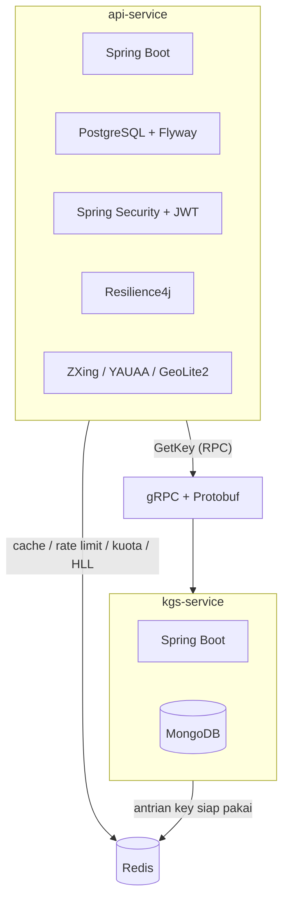
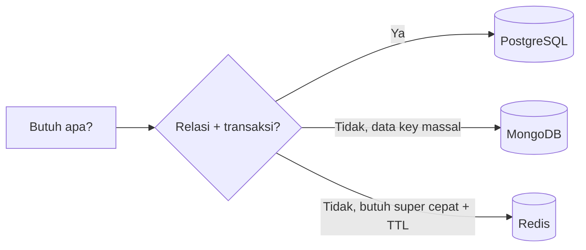

# Teknologi yang Digunakan (Tech Stack) - Shortly

> Dokumen ini menjelaskan setiap teknologi yang dipakai project Shortly: apa itu, dipakai di mana, manfaatnya di sistem ini, dan kelebihannya. Dokumen ini melengkapi [ARCHITECTURE.md](ARCHITECTURE.md) yang membahas alur & arsitektur.

Fokus utama (sesuai permintaan): kenapa memakai **MongoDB** dan **Redis**, dan apa untungnya.

---

## Daftar Isi

1. [Ringkasan Tech Stack](#1-ringkasan-tech-stack)
2. [Penjelasan Detail Per Teknologi](#2-penjelasan-detail-per-teknologi)
3. [Fokus Khusus: MongoDB vs PostgreSQL vs Redis](#3-fokus-khusus-mongodb-vs-postgresql-vs-redis)
4. [Ringkasan Manfaat Menyeluruh](#4-ringkasan-manfaat-menyeluruh)

---

## 1. Ringkasan Tech Stack

| Teknologi | Versi | Kategori | Modul | Peran singkat |
|---|---|---|---|---|
| Java | 21 | Bahasa | semua | Bahasa utama |
| Spring Boot | 3.5.11 | Framework | api-service, kgs-service | Kerangka aplikasi |
| Maven (multi-module) | - | Build | root | Build & artefak bersama |
| PostgreSQL | (runtime) | DB Relasional | api-service | Data inti (user, url, dll) |
| Flyway | (managed) | Migrasi DB | api-service | Versioning skema DB |
| MongoDB | (starter) | DB Dokumen | kgs-service | Pool short key |
| Redis | (starter) | In-memory store | api-service, kgs-service | Cache, limit, antrian, dll |
| gRPC | 1.60.1 / 1.58.0 | RPC | proto, api, kgs | Komunikasi antar-service |
| Protobuf | 3.25.3 | Serialisasi | proto | Kontrak data biner |
| Spring Security | (managed) | Keamanan | api-service | AuthN/AuthZ |
| JJWT | 0.11.5 | Token | api-service | JWT |
| Resilience4j | 2.4.0 | Fault tolerance | api-service | Retry & Circuit Breaker |
| ZXing | 3.5.4 | Library | api-service | Generate QR code |
| YAUAA | 8.1.1 | Library | api-service | Parse User-Agent |
| MaxMind GeoIP2 | 5.1.0 | Library | api-service | GeoIP offline |
| SpringDoc OpenAPI | 2.7.0-RC1 | Dokumentasi | api-service | Swagger UI |

Pemetaan teknologi ke modul:

---

## 2. Penjelasan Detail Per Teknologi

### 2.1 Java 21

- **Apa itu:** Bahasa pemrograman utama untuk kedua service.
- **Dipakai di mana:** Seluruh kode `api-service`, `kgs-service`, `proto`.
- **Manfaat di project ini:** Ekosistem matang, tipe kuat sehingga error kontrak (mis. gRPC) tertangkap saat compile.
- **Kelebihan:** Virtual threads & peningkatan performa di versi LTS 21, kompatibel penuh dengan Spring Boot 3.x.

### 2.2 Spring Boot 3.5.11

- **Apa itu:** Framework aplikasi berbasis Spring dengan auto-configuration.
- **Dipakai di mana:** Kedua service (parent POM `spring-boot-starter-parent`).
- **Manfaat di project ini:** Starter dependency (`web`, `data-jpa`, `data-redis`, `data-mongodb`, `security`, `aop`) memangkas konfigurasi manual; dependency version dikelola BOM sehingga konsisten.
- **Kelebihan:** Konfigurasi lewat `application.properties`, embedded server, integrasi mulus dengan Redis/JPA/Mongo/Security.

### 2.3 Maven Multi-Module

- **Apa itu:** Struktur build dengan modul `api-service`, `kgs-service`, dan `proto`.
- **Dipakai di mana:** Root project.
- **Manfaat di project ini:** Modul `proto` di-compile sekali menjadi artefak `com.shortly:proto` lalu dipakai bersama oleh `api-service` (client) dan `kgs-service` (server) - satu sumber kebenaran kontrak gRPC.
- **Kelebihan:** Isolasi tanggung jawab per modul, dependency management terpusat.

### 2.4 PostgreSQL

- **Apa itu:** Database relasional (RDBMS).
- **Dipakai di mana:** `api-service` sebagai penyimpanan utama.
- **Manfaat di project ini:** Menyimpan data yang saling berelasi dan butuh integritas: `users`, `roles`, `plans`, `api_keys`, `quotas`, `urls`, `url_clicks`, `audit_logs`. Foreign key, transaksi ACID, dan constraint unik (mis. `short_key`, `email`) menjaga konsistensi.
- **Kelebihan:** Query relasional kuat (JOIN, agregasi `GROUP BY` untuk analytics), transaksi ACID, dukungan tipe kaya (UUID, timestamp), soft-delete via kolom `deleted_at`.
- **Alternatif & alasan:** MongoDB kurang cocok untuk data yang butuh relasi & agregasi transaksional seperti ini.

### 2.5 Flyway

- **Apa itu:** Tool migrasi/versioning skema database.
- **Dipakai di mana:** `api-service`, folder `db/migration` (V1 s/d V14).
- **Manfaat di project ini:** Setiap perubahan skema tercatat berurutan (mis. `V12` tambah status URL, `V13` tabel `url_clicks`, `V14` backfill seed). Migrasi lama tidak diubah agar checksum tetap valid.
- **Kelebihan:** Skema DB dapat direproduksi di semua environment, riwayat perubahan jelas, aman untuk tim.

### 2.6 MongoDB

- **Apa itu:** Database dokumen (NoSQL) berbasis JSON/BSON.
- **Dipakai di mana:** `kgs-service`, collection `shortly_keys` (dokumen `ShortlyKey{ id, key (unique index), status, createdAt }`).
- **Manfaat di project ini:** KGS memproduksi short key Base62 dalam jumlah besar (batch 1000). Data key bersifat sederhana, mandiri (tidak berelasi ke tabel lain), dan bervolume tinggi - cocok untuk document store. Index unik pada field `key` menjamin tidak ada duplikat.
- **Kelebihan:** Skema fleksibel, write throughput tinggi untuk data sederhana, mudah discale horizontal (sharding), index unik cepat.
- **Alternatif & alasan:** Tidak perlu relasi/JOIN untuk data key, jadi RDBMS akan overkill; MongoDB lebih ringan untuk pola "generate massal + tandai USED".

### 2.7 Redis

Redis adalah komponen paling banyak dipakai. Ini in-memory data store yang sangat cepat, dipakai di **kedua** service dengan banyak peran.

- **Apa itu:** Penyimpanan key-value in-memory dengan struktur data (String, List, HyperLogLog, dll) dan dukungan TTL.
- **Dipakai di mana & untuk apa:**

| Peran | Struktur Redis | Key/pola | Kenapa Redis |
|---|---|---|---|
| Cache URL (redirect) | String (TTL) | `url:{shortKey}` | Redirect harus super cepat tanpa hit DB |
| Cache plan/limit | String (TTL 1 jam) | `plan:{hash}` | Hindari query berulang saat cek limit |
| Cache info user | String (TTL 24 jam) | `auth:user:{email}` | Percepat load UserDetails |
| Rate limiting | String counter (TTL s/d midnight) | `rate_limit:{hash}:{date}` | `INCR` atomik & TTL otomatis reset |
| Kuota URL | String counter | `quota:{hash}` | Hitung cepat, `INCR`/`DECR` atomik |
| Refresh token | String (TTL 7 hari) | `refresh_token:{token}` | Sesi stateless yang bisa dicabut |
| Token blacklist (logout) | String (TTL = sisa umur token) | `token_blacklist:{token}` | Batalkan access token sebelum expired |
| Unique visitor | HyperLogLog | `analytics:hll:{urlId}:{date}` | Hitung unik hemat memori |
| Cache QR code | String byte (TTL 24 jam) | `qr:{id}:{size}:{format}` | Hindari render ulang QR |
| Antrian short key (KGS) | List | `shortly-kgs-redis-queue` | Ambil key siap pakai instan (`RPOP`) |

- **Manfaat di project ini:**
  - **Kecepatan redirect** - lookup `url:{shortKey}` dari memori jauh lebih cepat daripada query PostgreSQL.
  - **Atomicity** - operasi `INCR`/`DECR`/`PFADD` aman untuk rate limit & kuota tanpa race condition.
  - **TTL otomatis** - data kedaluwarsa sendiri (rate limit reset harian, blacklist ikut umur token, cache QR 24 jam).
  - **HyperLogLog** - menghitung unique visitor dengan memori sangat kecil (~12KB) meski jutaan pengunjung, dengan sedikit toleransi error.
  - **Antrian di KGS** - `List` Redis membuat short key selalu siap diambil tanpa generate on-the-fly.
- **Kelebihan:** Latensi sub-milidetik, struktur data khusus (HLL, List), dukungan TTL bawaan, sangat cocok untuk cache & counter.

### 2.8 gRPC + Protobuf

- **Apa itu:** gRPC = framework RPC berkinerja tinggi; Protobuf = format serialisasi biner + bahasa kontrak (`key.proto`).
- **Dipakai di mana:** `proto` mendefinisikan `KeyService/GetKey`; `kgs-service` sebagai server (`net.devh grpc-server-spring-boot-starter`), `api-service` sebagai client (`KgsClient`).
- **Manfaat di project ini:** `api-service` meminta short key ke `kgs-service` lewat satu RPC unary yang cepat dan berkontrak jelas.
- **Kelebihan vs REST/JSON:** Payload biner lebih kecil & cepat, kontrak `.proto` kuat (tipe tervalidasi saat compile), dukungan multi-bahasa, HTTP/2 (multiplexing).

### 2.9 Spring Security + BCrypt

- **Apa itu:** Framework keamanan Spring + algoritma hashing password BCrypt.
- **Dipakai di mana:** `api-service` (`ApiSecurityConfig`, filter chain, `@PreAuthorize`).
- **Manfaat di project ini:** Mengatur endpoint publik vs terproteksi, sesi `STATELESS`, otorisasi admin via `hasRole('ADMIN')`, dan menyimpan password sebagai hash BCrypt (bukan plaintext).
- **Kelebihan:** Standar industri, filter chain fleksibel, BCrypt tahan brute-force (salt + cost factor).

### 2.10 JWT (JJWT 0.11.5)

- **Apa itu:** JSON Web Token untuk autentikasi stateless.
- **Dipakai di mana:** `JwtService`/`JwtServiceImpl`, diverifikasi `JwtAuthenticationFilter`.
- **Manfaat di project ini:** Server tidak perlu simpan sesi; identitas user ada di token yang ditandatangani (HMAC). Logout memanfaatkan blacklist Redis untuk mencabut token sebelum expired.
- **Kelebihan:** Skalabel (stateless), mudah dibawa di header `Authorization`, klaim `exp` untuk masa berlaku.

### 2.11 Resilience4j 2.4.0

- **Apa itu:** Library fault tolerance ringan (Retry, Circuit Breaker, dll).
- **Dipakai di mana:** `KgsClient.getKey()` dengan `@Retry` + `@CircuitBreaker`.
- **Manfaat di project ini:** Jika `kgs-service` lambat/down, panggilan otomatis di-retry, dan circuit breaker mencegah cascade failure; ada fallback (UUID substring) agar pembuatan URL tetap jalan.
- **Kelebihan:** Ringan, integrasi anotasi dengan Spring Boot 3, mencegah kegagalan berantai antar-service.

### 2.12 ZXing 3.5.4

- **Apa itu:** Library encoding/decoding barcode & QR.
- **Dipakai di mana:** `QrCodeServiceImpl` untuk fitur QR (`/urls/{id}/qr`).
- **Manfaat di project ini:** Meng-encode short URL menjadi gambar QR (PNG/SVG) langsung di dalam proses, hasilnya di-cache di Redis.
- **Kelebihan:** Matang, mendukung banyak format, tanpa layanan eksternal.

### 2.13 YAUAA 8.1.1

- **Apa itu:** "Yet Another UserAgent Analyzer", parser User-Agent.
- **Dipakai di mana:** `AnalyticsServiceImpl` (di-bean-kan lewat `UserAgentAnalyzerConfig`).
- **Manfaat di project ini:** Mengurai header User-Agent tiap klik menjadi device/OS/browser untuk analytics.
- **Kelebihan:** Akurat, offline (tanpa panggilan API eksternal), rule-based.

### 2.14 MaxMind GeoIP2 5.1.0 (GeoLite2)

- **Apa itu:** Library lookup lokasi berdasarkan IP menggunakan database `.mmdb` lokal.
- **Dipakai di mana:** `GeoIpServiceImpl` untuk analytics `by_country`.
- **Manfaat di project ini:** Menentukan negara pengunjung dari IP secara offline; bila file `.mmdb` tidak ada, sistem tetap jalan (graceful degradation, country null).
- **Kelebihan:** Cepat (lokal, tanpa network), privasi terjaga, tidak bergantung kuota API pihak ketiga.

### 2.15 SpringDoc OpenAPI 2.7.0-RC1

- **Apa itu:** Generator dokumentasi OpenAPI + Swagger UI.
- **Dipakai di mana:** `api-service` (`/swagger-ui/`, `/v3/api-docs`).
- **Manfaat di project ini:** Semua endpoint terdokumentasi otomatis dan bisa dicoba langsung dari browser.
- **Kelebihan:** Sinkron dengan kode, mempercepat testing & onboarding.

---

## 3. Fokus Khusus: MongoDB vs PostgreSQL vs Redis

Ketiga penyimpanan dipakai untuk tujuan berbeda. Ini kunci desain sistem.

| Aspek | PostgreSQL | MongoDB | Redis |
|---|---|---|---|
| Jenis | Relasional (ACID) | Dokumen (NoSQL) | In-memory key-value |
| Modul | api-service | kgs-service | keduanya |
| Menyimpan apa | Data inti berelasi (user, url, click, quota) | Pool short key (`shortly_keys`) | Cache, counter, antrian, token, HLL |
| Kapan dipakai | Butuh relasi, transaksi, agregasi | Data sederhana bervolume besar tanpa relasi | Butuh kecepatan tinggi & TTL |
| Contoh nyata | `GROUP BY` analytics; FK `url_clicks -> urls` | index unik `key` batch 1000 | `analytics:hll:*`, `shortly-kgs-redis-queue` |
| Durabilitas | Tinggi (persisten) | Tinggi (persisten) | Utamanya cache (bisa persist, tapi dipakai sebagai layer cepat) |

Ringkasnya:

- **PostgreSQL** = sumber kebenaran (source of truth) data bisnis.
- **MongoDB** = gudang produksi short key yang bisa digenerate massal dan cepat.
- **Redis** = lapisan percepatan (cache), penghitung atomik (rate limit/kuota/analytics), dan antrian.

---

## 4. Ringkasan Manfaat Menyeluruh

Kombinasi stack ini mendukung empat kualitas utama:

- **Performa:** Redirect memakai cache Redis (`url:{shortKey}`) dan short key diambil instan dari antrian Redis KGS; pencatatan analytics berjalan async agar tidak memperlambat response.
- **Skalabilitas:** Service terpisah (api vs kgs) berkomunikasi via gRPC; MongoDB & Redis mudah discale untuk beban tinggi; JWT membuat autentikasi stateless.
- **Ketahanan (resilience):** Resilience4j (retry + circuit breaker) + fallback menjaga sistem tetap jalan meski KGS bermasalah; GeoIP graceful degradation.
- **Keamanan:** Spring Security + BCrypt + JWT dengan blacklist logout, plus API key ter-hash (SHA-256) untuk akses programatik.

> Catatan versi: terdapat perbedaan versi gRPC antar modul (`proto`/`api-service` 1.60.1 vs BOM `kgs-service` 1.58.0). Ini dibiarkan by-design karena tidak mengganggu runtime; lihat catatan di [ARCHITECTURE.md](ARCHITECTURE.md).
